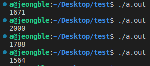

Data Race와 Race Condition를 작년에 잘 공부했다고 생각했는데,
Unity 개발 중 Coroutine을 사용하며, 완전히 잘못 이해하고 있었다는 걸 알았다.

Data Race는 그저 '다중 스레드/프로세스 환경에서 공유 자원에 접근할 때의 문제', Race Condition은 'Data Race가 발생했을 때의 상태'라고 알고 있었다.
둘을 명확히 구분하지 못했고, 정확히 알고있지도 않았다.

## Race Condition

여러 이벤트/실행가 실행되는 시점이나 순서가 결과에 영향을 주는 상황.
다중 스레드/프로세스 상황이 아닌 비동기 상황에서 발생할 수 있음.

#### 예제

```cs
public class test : MonoBehaviour {
  static int SharedA = 0;

  void Start() {
    StartCoroutine(TestCoroutine());
  }

  IEnumerator TestCoroutine() {
    SharedA++;
    if (SharedA == 0) {
      yield return new WaitForSeconds(1);
      Debug.Log("SharedA가 20보다 작습니다. SharedA: " + SharedA.ToString());
    }
    yield return null;
  }
}
```

#### 결과



Unity의 Coroutine은 단일 스레드로 작동하지만 Race Condition이 발생할 수 있다.

## Data Race

다중 스레드/프로세스가 공유 자원에 동시에 접근할 때, 그리고 적어도 하나의 스레드/프로세스의 접근이 쓰기 작업일 때, 접근 순서에 따라 잘못된 값을 읽거나 쓰게 되는 Race Condition의 한 종류

#### 예제

```c
#include <pthread.h>
#include <stdio.h>

int shared; // = 0;

void *func(void *arg) {
  for (int i = 0; i < 1000; i++) shared += 1;
}

int main() {
  pthread_t t[2];
  for (int i = 0; i < 2; i++) pthread_create(&t[i], NULL, func, NULL);
  for (int i = 0; i < 2; i++) pthread_join(t[i], NULL);
  printf("%d\n", shared);
  return 0;
}
```

#### 결과


2000이 나오지 않을 수 있다.

## 마침

나는 Data Race만 배우고, Race Condition은 Data Race가 일어나는 상황이라고 이해하고 있어서 다중 스레드/프로세스 환경에서 발생하는 줄 알았다.
그런데 Unity에서 비동기 프로그래밍을 하다보니 Race Condition이 일어날 수 있다는 건 느껴졌는데, 그걸 Data Race라고 알고 있으니까 'Data Race는 다중 스레드/프로세스 환경이어야 하지 않나?? 근데 Coroutine은 단일 스레드인데??'라는 생각이 들었다.
반성 중...