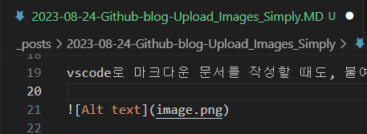
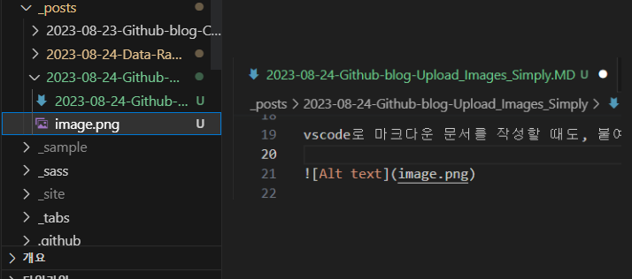
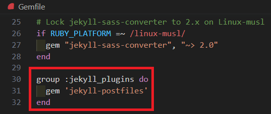
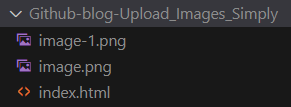

### 불편함

글에 이미지를 삽입할 때, 클립보드에 있는 이미지를 바로 붙여넣기(ctrl/cmd + v)로 삽입할 때가 많다.

개발자들이 블로그에 올릴 마크다운 문서를 vscode로 많이 작성하는데, vscode에서 클립보드에 있는 이미지 삽입을 위해 주로 두 가지 방법을 쓰는 것 같다.

1. 이미지를 저장하고, assets/img 폴더(든 어디든)에 옮긴 후, 다시 그 경로를 적는다.
   - 말도 안 나올 정도로 끔찍하게 불편하고 귀찮다.
2. Github Issues에 붙여넣기 후, 업로드 되면 그 주소를 적는다.
   - 1번보다는 나은데, 이미지를 수정할 수가 없다.

원본 이미지가 있는 경우는 그 이미지의 주소를 적는 경우도 있는데, 원본 이미지가 사라지면 내 블로그에서도 사라지고, 2번과 마찬가지로 이미지를 수정할 수도 없다.


### jekyll-postfiles 플러그인

[https://nhoizey.github.io/jekyll-postfiles/](https://nhoizey.github.io/jekyll-postfiles/)

이걸 사용하면 진짜 진짜 편하다.

vscode로 마크다운 문서를 작성할 때도, 붙여넣기를 하면 글에 바로 이미지가 삽입되고





이렇게 같은 폴더에 이미지가 저장된다.

기본적으로 Jekyll은 _posts에 있는 이미지는 빌드 과정에서 복사해오지 않는데

`jekyll-postfiles` 플러그인을 사용해 해결할 수 있다.



```
group :jekyll_plugins do
  gem 'jekyll-postfiles'
end
```
Gemfile에 이 코드를 추가하고 업로드하면



빌드할 때 이렇게 이미지까지 복사해온다.

보다시피 정상적으로 업로드됐다.

이제 복사 → 붙여넣기 두 과정으로 글에 이미지를 첨부할 수 있다!!

위에서 소개한 두 가지 방법보다 훨씬 편하고, 이미지가 같은 폴더 안에 들어가서 이미지 관리도 훨씬 쉽다.

### 마침

- 예전에 Github Blog 운영하려다가 접은 이유가, 이 이미지 업로드가 불편했기 때문인데 불편함이 해소돼서 더 유지할 수 있지 않을까 싶다.
- 이 기능 때문에 플러그인을 만들어야 하나... 생각했는데 직접 만든 플러그인은 whitelist에 추가되지 않으면 빌드할 때 제외된다고 한다. 잘 찾아보니 다행히 이미 있었다.
- 소개하는 사람은 거의 없는 거 같은데 왜 그럴까?? 왜 안 쓰는지 도저히 모르겠다. 진짜 편한데